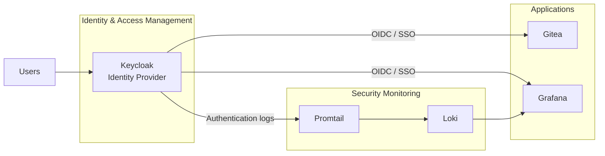

# IAM in Practice – From Identity to Access

A practical Identity and Access Management (IAM) lab built to demonstrate how identities, roles, access, Single Sign-On, lifecycle management and security monitoring work together in a small but realistic environment.

The project was created as part of my Cybersecurity Officer education. I wanted to understand IAM beyond theory, so instead of only describing concepts such as SSO, RBAC and Joiner/Mover/Leaver, I built an environment where the concepts can be tested and demonstrated in practice.

The central question behind the project is:

> How do we make sure that the right person has the right access to the right resource at the right time — and that we can trace what happens?

> **Note:** This is a local learning and demonstration environment, not a production deployment. NIS2 and ISO/IEC 27001 are used as security context and inspiration, not as a compliance claim.

---

## Project goals

The project demonstrates:

- Central identity management with Keycloak
- Single Sign-On (SSO) using OpenID Connect (OIDC)
- Role-Based Access Control (RBAC)
- Groups and role assignments
- Joiner, Mover and Leaver (JML) lifecycle scenarios
- Least Privilege and separation of duties
- Application access through Gitea and Grafana
- Centralized authentication logging with Promtail and Loki
- Security monitoring and visualization in Grafana
- Traceability of successful and failed login attempts
- Infrastructure and configuration documented as code/configuration files

---

## Architecture



The authentication flow is intentionally centralized. Users authenticate against Keycloak, while connected applications trust Keycloak through OIDC.

The monitoring flow is separate:

```text
Keycloak -> Promtail -> Loki -> Grafana
```

---

## Technology and development stack

| Component | Purpose |
|---|---|
| **Keycloak** | Central Identity Provider and IAM platform |
| **Gitea** | Demo application protected by Keycloak SSO |
| **Grafana** | Security dashboard and second SSO-enabled application |
| **Loki** | Central log storage |
| **Promtail** | Collects Keycloak container logs and forwards them to Loki |
| **Docker Desktop** | Runs the containerized lab on Windows 11 |
| **Docker Compose** | Defines and starts the complete multi-container environment |
| **YAML** | Configuration format used for Docker Compose, Loki, Promtail and Grafana provisioning |
| **Visual Studio Code** | Main editor used to create and maintain configuration files, scripts and documentation |
| **Git Bash** | Main terminal used to run Docker, Git and Keycloak administration commands quickly |
| **Git / GitHub** | Version control, project history and documentation |
| **FigJam** | Process mapping, planning and IAM lifecycle visualization |

### Why I used Visual Studio Code, YAML and Git Bash

I built most of the project from **Visual Studio Code**. It gave me one place to work with the Docker Compose file, YAML configuration, shell scripts and Markdown documentation while keeping the repository structure visible.

The most important infrastructure file is `docker-compose.yml`. I created it so that the full lab could be defined in one place instead of installing and configuring every service directly in Windows. The file describes which containers should run, their ports, persistent storage, environment variables, dependencies and network connections.

Additional YAML files configure the logging and monitoring components:

```text
docker-compose.yml       -> defines the complete lab environment
loki-config.yml          -> configures Loki log storage
promtail-config.yml      -> defines which logs Promtail collects
grafana/provisioning/    -> provisions Grafana resources such as the Loki datasource
```

**Git Bash** became an important part of the workflow. Instead of repeatedly navigating through graphical menus, I could run and reuse commands for Docker, Keycloak and Git directly from the terminal. This saved a lot of time during setup, troubleshooting and repeated testing.

Examples:

```bash
# Start the complete lab
docker compose up -d

# Check all containers
docker compose ps

# Inspect recent Keycloak authentication events
docker logs iam-keycloak --since 2m

# Run Keycloak administration commands without Git Bash path conversion
MSYS_NO_PATHCONV=1 docker exec iam-keycloak /opt/keycloak/bin/kcadm.sh ...
```

This combination also made the project more reproducible: configuration is stored in files and repeatable commands can be documented instead of relying only on manual GUI changes.

More detail: [Development workflow](docs/DEVELOPMENT.md)

---

## Test identities

Each identity represents a separate business function so that access decisions are easy to demonstrate.

| User | Function | Group | IAM role / purpose |
|---|---|---|---|
| `emma.hr` | HR | HR | HR/business user |
| `david.developer` | Developer | Developers | Gitea developer |
| `hanna.helpdesk` | Helpdesk | Helpdesk | Support user with limited privileges |
| `simon.security` | Security | Security | Security monitoring / Grafana Editor |
| `adam.iamadmin` | IAM Administrator | IAM-Admins | IAM administration / Grafana Admin |

The identities are intentionally separated by function. An employee should not receive unrelated administrative privileges simply because they have an account in the environment.

---

## IAM model

The lab separates three important concepts:

1. **Identity** – who the user is.
2. **Access management** – what access is granted, changed or revoked.
3. **Governance** – why the user should have access, who approved it and whether it is still needed.

The project also distinguishes between:

- **Birthright access** – basic access associated with employment or a function.
- **Additional access** – access granted for a specific work requirement.
- **Temporary access** – access that should later expire or be removed.

This is important because a realistic business role should not automatically contain every entitlement a person might ever need.

---

## Current working functionality

The current lab can demonstrate:

- Keycloak realm: `iam-in-practice`
- Test users, groups and realm roles
- Gitea authentication through Keycloak using OIDC
- Grafana authentication through Keycloak using OIDC
- Grafana role mapping based on Keycloak realm roles
- Successful and failed Keycloak authentication events
- Promtail collecting only Keycloak container logs
- Loki storing authentication events centrally
- Grafana visualizing successful and failed login activity
- A dynamic Grafana time range that controls the dashboard panels
- Basic Joiner, Mover and Leaver lifecycle demonstrations
- Least Privilege through separated identities and responsibilities

---

## IAM Security Monitoring dashboard

The Grafana dashboard is named:

**IAM Security Monitoring**

Current panels:

- Failed Logins
- Failed Login Events
- Successful Logins
- Successful Login Events

The Grafana time picker controls the time range for the whole dashboard.

### Failed login counter

```logql
sum(count_over_time({job="keycloak"} |= "LOGIN_ERROR" |= "invalid_user_credentials" [$__range]))
```

Query type: **Instant**

### Successful login counter

```logql
sum(count_over_time({job="keycloak"} |= "type=\"LOGIN\"" [$__range]))
```

Query type: **Instant**

### Failed login events

```logql
{job="keycloak"} |= "LOGIN_ERROR"
| regexp `clientId="(?P<application>[^"]+)".*username="(?P<username>[^"]+)"`
| line_format `User: {{.username}} | Application: {{.application}} | FAILED`
```

### Successful login events

```logql
{job="keycloak"} |= "type=\"LOGIN\""
| regexp `clientId="(?P<application>[^"]+)".*username="(?P<username>[^"]+)"`
| line_format `User: {{.username}} | Application: {{.application}} | SUCCESS`
```

The dashboard makes identity activity easy to demonstrate without showing long raw Keycloak log lines.

---

## Practical demonstration

A simple end-to-end demo can show the complete relationship between identity, access and monitoring:

1. Show users, groups and roles in Keycloak.
2. Explain why different functions receive different access.
3. Log in as `david.developer` to Gitea through Keycloak SSO.
4. Show that Gitea trusts Keycloak for authentication.
5. Perform an incorrect login attempt.
6. Open Grafana and show the failed login event and username.
7. Perform a successful login and show the successful event.
8. Change a group or role to demonstrate a Mover scenario.
9. Disable a user to demonstrate a Leaver scenario.
10. Explain how Least Privilege and lifecycle management reduce unnecessary access.

Detailed presentation flow: [Practical Demo Plan](docs/DEMO.md)

---

## Repository structure

```text
IAM-in-Practice/
├── README.md
├── .gitignore
├── docker/
│   ├── docker-compose.yml
│   ├── loki-config.yml
│   ├── promtail-config.yml
│   └── grafana/
│       └── provisioning/
│           └── datasources/
│               └── loki.yml
├── keycloak/
│   └── setup-grafana-oidc.sh
└── docs/
    ├── ARCHITECTURE.md
    ├── DEVELOPMENT.md
    ├── IAM-DESIGN.md
    ├── JML.md
    ├── MONITORING.md
    ├── DEMO.md
    ├── SETUP.md
    ├── SECURITY.md
    ├── TROUBLESHOOTING.md
    └── PROJECT-REFLECTION.md
```

---

## Documentation

- [Architecture](docs/ARCHITECTURE.md)
- [Development workflow](docs/DEVELOPMENT.md)
- [IAM design](docs/IAM-DESIGN.md)
- [Joiner, Mover, Leaver](docs/JML.md)
- [Security monitoring](docs/MONITORING.md)
- [Practical demo plan](docs/DEMO.md)
- [Setup](docs/SETUP.md)
- [Security considerations](docs/SECURITY.md)
- [Troubleshooting](docs/TROUBLESHOOTING.md)
- [Project reflection](docs/PROJECT-REFLECTION.md)

---

## Scope

### Must Have

- Central Identity Provider
- Test identities
- Groups and roles
- Gitea OIDC SSO
- Grafana OIDC SSO
- JML demonstration
- Authentication logging
- Security monitoring dashboard

### Nice to Have

- More granular application authorization
- Access review workflow
- Temporary access / expiry
- Additional dashboards and alerts
- Automated provisioning

### Future development

- Identity Governance and Administration (IGA)
- Privileged Access Management (PAM)
- Automated JML using an authoritative HR source
- Access request and approval workflow
- Periodic access reviews
- Stronger MFA policies
- Conditional or context-aware access controls
- Automated provisioning through APIs or SCIM
- Integration with a larger SIEM environment

---

## Security note

Do not commit real secrets, passwords or client secrets to GitHub.

Secrets should be stored in environment variables, a local `.env` file excluded by `.gitignore`, or a dedicated secrets-management solution.

The configuration and credentials used in this repository are intended only for an isolated learning environment.

---

## Author

**Mario Krnjic**  
Cybersecurity Officer student
