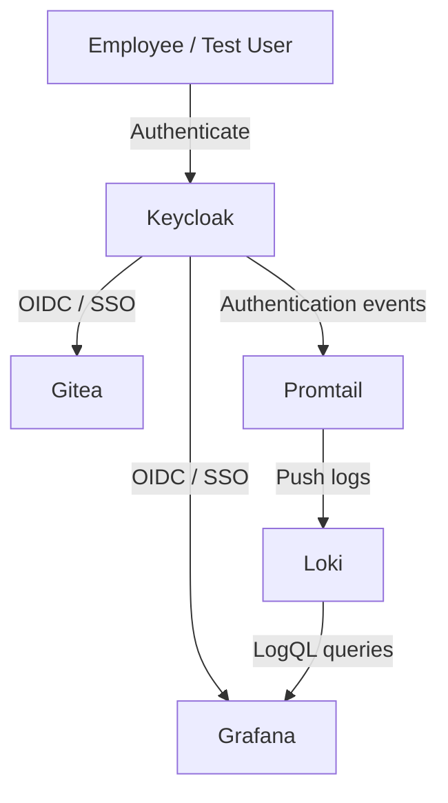

# Architecture

## Overview

The lab is built around Keycloak as the central Identity Provider. Connected applications redirect users to Keycloak using OpenID Connect instead of each application maintaining a completely separate primary authentication flow.



## Two main flows

### Identity and access flow

```text
User -> Keycloak -> OIDC token/session -> Application
```

The application trusts Keycloak as the Identity Provider.

### Monitoring flow

```text
Keycloak -> container log -> Promtail -> Loki -> Grafana
```

This separates authentication from monitoring while still connecting the events to the identity environment.

## Component responsibilities

### Keycloak

Keycloak is the central control point for identity and authentication.

It contains:

- users
- groups
- realm roles
- OIDC clients
- authentication settings
- authentication events

### Gitea

Gitea represents a business application that uses Keycloak for SSO.

It demonstrates that the identity platform can provide authentication to a separate application.

### Grafana

Grafana has two functions:

1. It authenticates users through Keycloak.
2. It visualizes identity/security events stored in Loki.

Grafana roles are also mapped from Keycloak realm roles to demonstrate authorization after authentication.

### Promtail

Promtail collects the Keycloak container logs and sends them to Loki.

The final configuration intentionally collects **only Keycloak logs**. Earlier testing collected all Docker container logs, which created duplicate/noisy results because monitoring components could contain the same search text.

### Loki

Loki stores the collected log events and makes them searchable using LogQL.

### Docker Compose

Docker Compose defines how all services fit together.

The `docker-compose.yml` file describes:

- containers
- ports
- persistent volumes
- environment variables
- dependencies
- networking

This is the main file used to recreate and start the local architecture.

## Configuration architecture

```text
Visual Studio Code
        |
        +--> docker-compose.yml
        +--> loki-config.yml
        +--> promtail-config.yml
        +--> Grafana provisioning YAML
        +--> Keycloak setup scripts
        +--> Markdown documentation

Git Bash
        |
        +--> docker compose commands
        +--> docker logs
        +--> kcadm.sh commands
        +--> git commands
```

## Ports used in the lab

| Service | Local address |
|---|---|
| Keycloak | `http://localhost:8080` |
| Gitea | `http://localhost:3001` |
| Grafana | `http://localhost:3000` |
| Loki | `http://localhost:3100` |

## Persistent data

Persistent service data is stored outside the containers on the `D:` drive. This allows containers to be recreated without losing important lab state such as the Keycloak realm or Gitea data.

## Design principle

The architecture is intentionally lightweight. The purpose is not to reproduce a full enterprise IAM/IGA platform but to make the main identity and access concepts visible, testable and explainable in a local environment.
